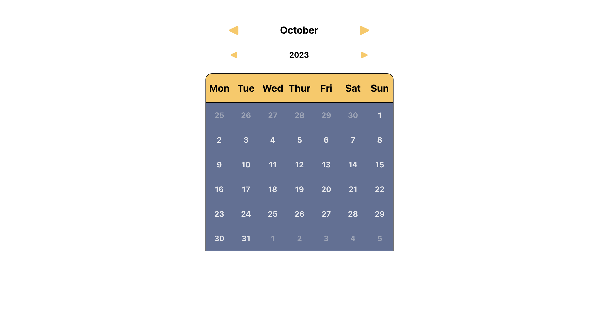
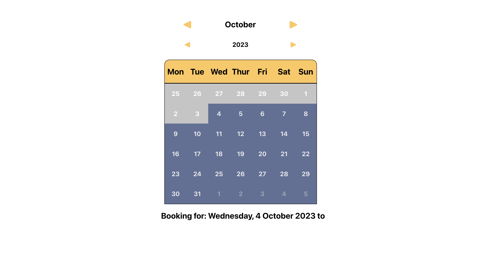
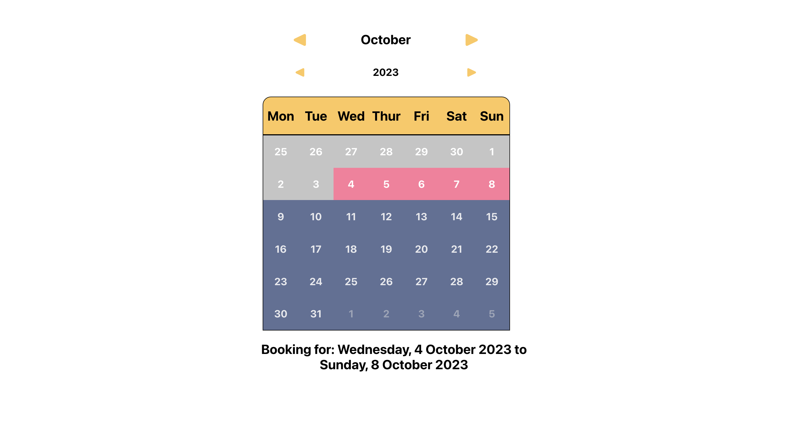
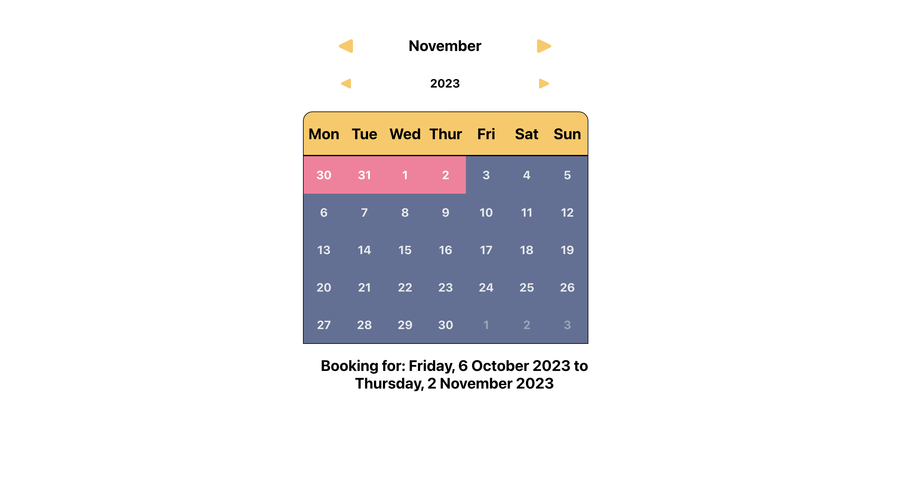

# Calendar React component

This component displays a functional date selector calendar, which could be used for a hotel booking service or similar. It primarily leans on the date class system built into JS, with the dates styled in a grid and displayed based on conditional classnames using if statements and CSS.

## In detail

The calendar populates a grid with the days of the selected month, ensuring that the dates line up with the appropriate day of the week shown in the top row (that is, 2 October sits in the ‘Mon’ column, 3 October in the ‘Tue’ column and so on). It populates the remainder of the first and last week of the month with however many days of the previous and next month are needed to show a complete Monday to Sunday week (for example, if the last day of October is Tuesday, then 1–5 November will also be shown in a lower opacity so there are days populating Wednesday to Sunday).

The user can select any day of a month on click, and then select a future date on click to indicate the time and length of a potential stay. The calendar blocks people from selecting dates that are behind the first selected date, with the understanding that the first day selected is the beginning of a stay and so cannot go backwards (though this could be turned off pretty simply if this feature wasn't needed). Once a user selects an initial date, all the dates previous to that date are made grey and uninteractable to indicate this feature visually. Overall this design could be implemented in conjunction with an API call to indicate if the selected dates are available to a user.

After clicking the end date of a stay, the user can click a different day to choose a different start day. This is done by checking if the first and second date states contain a date and then reverts the state to "" if the user clicks another day. This is intended to give the user an intuitive and minimal interface.

The user can switch between months or years using a simple forward/back button. Clicking these buttons does not wipe the state, so a user can click a date in October and then navigate to November or beyond to choose their concluding date.

The design of this component was chosen with contrast in mind. This is so users can clearly differentiate between dates of the month and the days of the week row, and between dates selected, dates that are invalid, and the range between the initial and concluding date.

Below the calendar, the selected dates are shown in text. This information could be shown in a more visually appealing way, but once the more enticing concept had been proved (that is, handling date selection, autopopulation and conditional styling), displaying redundant information within a monochrome, border radius-ed div felt more like an exercise in design rather than development, and so was likely beside the point.

## Demo images

The first picture shows the calendar component as it first appears, with days of the week shown on the top row in yellow, the dates of the month below and in blue, and the month and year shown above and within yellow arrows, which allow the user to change between months and years. Days from the previous and next month are also shown to ensure a full Monday to Sunday week is shown.

The second image shows the view once the user has selected the initial date. All days prior to that date become invalid selections, indicated through a grey background colour. The initial date selected also appears below the calendar in text.

The third image shows the view once the user has selected the concluding date. The classname for the first date, final date and all dates between changes based on an if statement, changing the background colour to a vibrant pink.

The final image shows the view in the next month if the second date extends across multiple months. This ensures users can switch between months without losing their initial selection.

